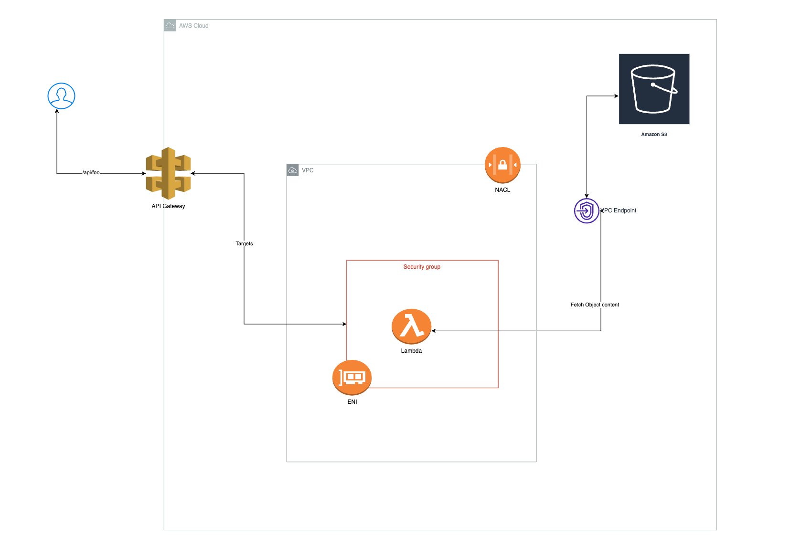

# AWS Serveless Demo - Lambda, API Gateway, S3 bucket with VPC integration

## Prerequisites

1. Install Terraform: Make sure you have Terraform installed on your local machine. You can download Terraform from the official website: https://www.terraform.io/downloads.html

2. AWS Account: You will need an AWS account to create resources using Terraform. If you don't have an account, you can sign up for a free tier account at https://aws.amazon.com/free/

3. AWS CLI: Install and configure the AWS CLI on your local machine. The AWS CLI will be used to create the IAM user for Terraform. You can download it from https://aws.amazon.com/cli/ and review instructions to work with [environment variables](https://docs.aws.amazon.com/cli/latest/userguide/cli-configure-envvars.html)

## Setup Terraform IAM User

1. Open the AWS Management Console and navigate to the IAM (Identity and Access Management) service.

2. Create a new user with programmatic access. Give the user a descriptive name, such as `tf-deploy`.

3. Choose "Attach existing policies directly" and search for the "AdministratorAccess" policy. For production environments, consider granting more restrictive policies based on your requirements.

4. Once the user is created, note down the "Access Key ID" and "Secret Access Key". These credentials to configure the AWS CLI but ensure to store this in a secured vault with proper access for future uses.

5. Configure AWS CLI on your local machine using the credentials obtained in the previous step. We will be leveraging environment variables.

```bash
export AWS_ACCESS_KEY_ID=<AWS_ACCESS_KEY_ID>
export AWS_SECRET_ACCESS_KEY=<AWS_SECRET_ACCESS_KEY>
export AWS_DEFAULT_REGION=<AWS_DEFAULT_REGION>
```
## Infrastructue Deploy



### Setup Backend
To setup the backend run the `init.sh` script in the repo, this will leverage the `backend` folder terraform script to create a bucket and setup `backend.tf` file for consumption in the actual IaC folder. The `init` flag also does the `terraform init` and `plan` for the actual infrastructure.

```bash
./init.sh init
```
### Deploy Infrastructure
```bash
terraform apply -auto-approve=true
```
This should output the required URL To visit to see the validate the REST API is functional